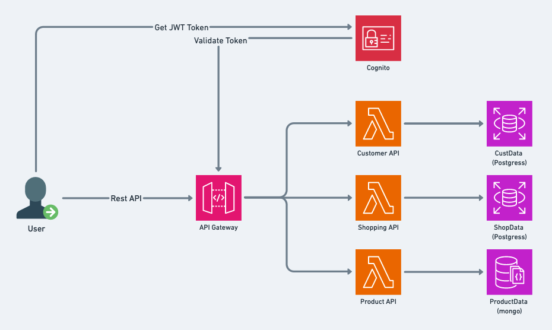

<p align="center">
  <a href="http://nestjs.com/" target="blank"></a>
</p>

[circleci-image]: https://img.shields.io/circleci/build/github/nestjs/nest/master?token=abc123def456
[circleci-url]: https://circleci.com/gh/nestjs/nest

  <p align="center">A progressive <a href="http://nodejs.org" target="_blank">Node.js</a> framework for building efficient and scalable server-side applications.</p>
 
## Description

This project allows you to build APIs that can be deployed in AWS Lambda or dockerized for EKS or ECS.

If you are a small startup with a tight budget, you can use this project to easily build 
and deploy APIs in AWS Lambda at the early stage of development. 
You don’t have to worry about scaling or managing the infrastructure, 
as AWS Lambda does it for you.

If you want to switch to Kubernetes later, 
you can also dockerize your APIs and deploy them in EKS or ECS. 
This gives you more flexibility and control over your deployment environment.

## Requirement
Project tested under these version : \
Node version - v20.x\
Npm Version - v10.x\
Serverless - v3.x

## Installation

```bash
$ yarn install
```

## Running the app

```bash
# development
$ yarn run start

# watch mode
$ yarn run start:dev

# production mode
$ yarn run start:prod
```

## Test

```bash
# unit tests
$ yarn run test

# e2e tests
$ yarn run test:e2e

# test coverage
$ yarn run test:cov
```

## Deploy in Lambda
Note - You must have aws account, 
aws cli command installed and aws api/secret key configured for command line.

Go through `serverless.yaml` file and read the comments to do required changes for your aws account.

```bash
# deploy in aws account
$ sls deploy

# remove from  aws account
$ sls remove

```

## System Design for API
